##### [jam3-lesson](https://github.com/Jam3/jam3-lesson) » webgl » shader-intro

---

# WebGL Lessons — Fragment Shaders

Shaders are a key concept in WebGL and graphics programming, so this lesson will be one of the first in our `jam3-lesson-webgl` series. Even if you only end up working with higher level abstractions (like ThreeJS and materials), understanding shaders will give you a better appreciation of the entire graphics pipeline.

Once you master shaders, you have a world of new effects, transitions, and rendering possibilities at your fingertips.

> 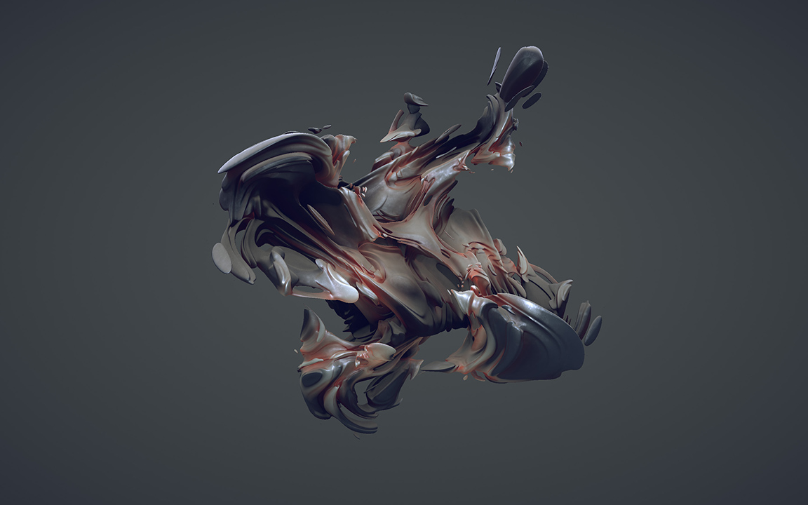  
>
> <sup>*A complex fragment shader rendering an abstract 3D mesh.* [(source)](https://www.shadertoy.com/view/XtjSDK)</sup>

This lesson will cover the very basics of GLSL, and introduce a couple of simple image effects.

## What are shaders?

Shaders are small programs written in the OpenGL Shading Language (GLSL), a language similar to C/C++. They are compiled specifically to run on the GPU, and take advantage of parallelization to quickly compute things like pixel color and vertex positions.

A simple program might look like this:

```glsl
precision highp float;
varying vec2 vUv;

void main () {
  gl_FragColor = vec4(vUv.xy, 1.0, 1.0);
}
```

Applied to a rectangle, we end up with:

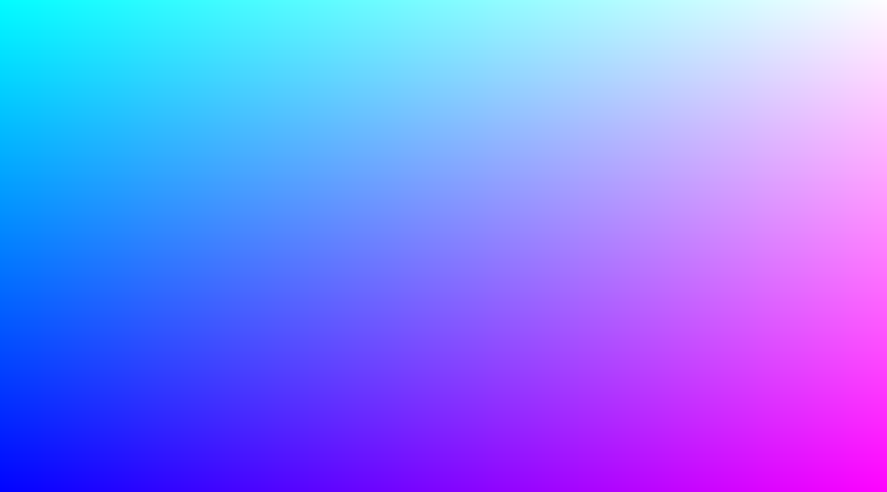


## Shader Types

There are two types of shader programs used in WebGL: *vertex* and *fragment* shaders. Together, they are used to draw content on the screen with WebGL.

- **Vertex Shaders** are typically used to place primitives (i.e. triangles, lines) in 2D or 3D space
- **Fragment Shaders** are typically used to output the pixel colors of these primitives

In a way, the vertex shaders figure out the shape, and the fragment shaders are painting in the color-by-number of each shape.

This lesson will focus on **Fragment Shaders**, since we can begin using them immediately to practice the language and concepts.

## What does a fragment shader do?

Fragment shaders, also known as *pixel shaders*, output a single color for each rendered *fragment*. In most cases, a fragment is just a single *pixel* on the screen.

The pixel color is stored with separate components for RGBA (Red, Green, Blue, Alpha). Each component is in the range 0.0 to 1.0, so:

- `(0.0, 0.0, 0.0, 1.0)` represents opaque black
- `(1.0, 1.0, 1.0, 1.0)` represents opaque white
- `(1.0, 0.0, 0.0, 0.5)` represents pure red with 50% alpha

The fragment shader is run once per pixel. In other words, if your canvas is 1920x1080 pixels and your triangle fills the whole canvas, the fragment shader will need to run **2,073,600** times per frame! GPUs can handle this because they draw many pixels *in parallel* (i.e. at the same time). Because of this, the program can only operate on a single pixel at a time, and can't access the values of neighbouring pixels.

## ShaderToy

We're going to write our shaders using an online tool called [Shadertoy](http://www.shadertoy.com). This will get us running without any boilerplate or set-up. Let's begin!

### Step 1. Turning The Screen Blue

Let's open up [Shadertoy.com](http://www.shadertoy.com) in Chrome or FireFox and click *New Shader* on the top right.

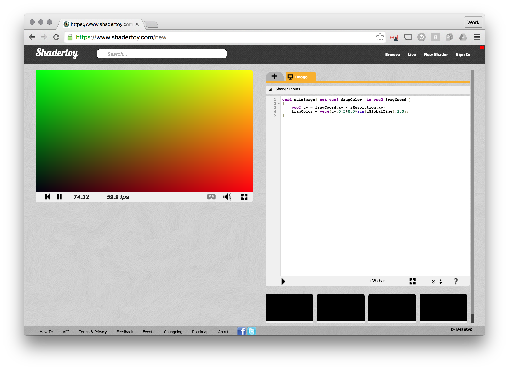

The left panel shows the WebGL canvas and the output of our shader. On the right, we have a code editor for our fragment shader, showing some GLSL code.

By modifying the value of `fragColor` — the output pixel color — we can produce a wide variety of images and effects. This is a 4-component vector, a `vec4`, holding the RGBA components we mentioned earlier.

Let's change this code to something simpler, to render a blue canvas. Remember that colors are `RGBA` vectors, so we can use `1.0` for the blue channel and `1.0` for the alpha channel.

```glsl
void mainImage( out vec4 fragColor, in vec2 fragCoord )
{
  fragColor = vec4(0.0, 0.0, 1.0, 1.0);
} 
```

After you change the code, press the **Play** button <kbd>▶</kbd> at the bottom of the code editor (or press <kbd>Cmd/Ctrl + Enter</kbd>).

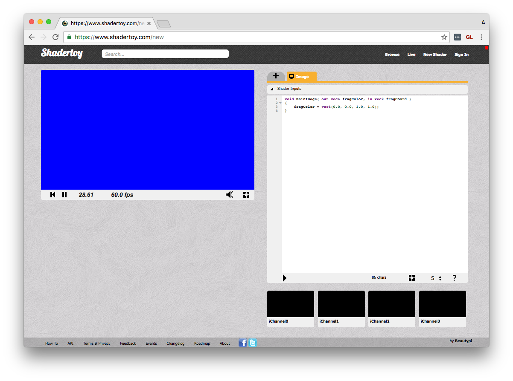

Woah, a blue rectangle! :sparkles:

## Data Types & Syntax

Before we go further, let's take a second to look at the syntax of GLSL.

In GLSL, a *vector* is much like an array of numbers, holding a fixed number of elements (2, 3, or 4). Here is a brief list of some data types available in GLSL:

  * `float` - a simple float value, e.g. 0.75
  * `vec2` - a vector with 2 floats, e.g. (x, y)
  * `vec3` - a vector with 3 floats, e.g. (x, y, z) or (r, g, b)
  * `vec4` - a vector with 4 floats, e.g. (r, g, b, a)
  * `int` - an integer, e.g. 4
  * `sampler2D` - a special type which we will get to when dealing with texture sampling

Notice that WebGL's GLSL compilers are a little picky. For example, the following might give us an error, because we are trying to give an `int` type where the compiler expects a `float`:

```glsl
float x = 5; // ERROR
vec2 v = vec2(10, 5); // ERROR
```

Instead, you should add a decimal place for float values, like so:

```glsl
float x = 5.0;
vec2 v = vec2(10.0, 5.0);
```

To create a new vector, you use the constructor like so:

```glsl
vec2 pixelPosition = vec2(125.0, 5.0);
vec3 position3d = vec3(5.0, 1.0, 2.0);
vec4 blue = vec4(0.0, 0.0, 1.0, 1.0);

// sets all components to 1.0
vec4 white = vec4(1.0);

// create a new vec4 from a vec3
vec4 color = vec4(blue, 1.0);
```

And we can access them in a number of ways:
```glsl
// copies only the first three components, notice we need to use vec3
vec3 other = myVec.xyz;
 
// copies all four components
vec4 aColor = myVec.rgba;

// copy only first three components
vec3 aColorRGB = myVec.rgb;
 
// "swizzles" the (x, y) components
myVec.xy = myVec.yx;

// the first component
float x = myVec.x;
 
// we could even treat vectors as an array
float e0 = myVec[0];
```

It doesn't matter whether you use `.rgba` or `.xyzw` to access a vector, so long as it's consistent (you cannot do `.rgzw`, for example). You can also use `.stpq` (typically used in texture coordinates), though it is less common.

Also useful to know is the `const` keyword, similar to ES2015, which allows us to declare constants. For example, our earlier shader could be written as:

```glsl
const vec3 blue = vec3(0.0, 0.0, 1.0); 

void mainImage( out vec4 fragColor, in vec2 fragCoord )
{
  fragColor = vec4(blue, 1.0);
} 
```

All of the following lines are equivalent:
```glsl
fragColor = vec4(blue, 1.0);
fragColor = vec4(blue.rgb, 1.0);
fragColor = vec4(blue.xyz, 1.0);
fragColor = vec4(vec3(blue), 1.0);
fragColor = vec4(blue.r, blue.g, blue.b, 1.0);
```

For a nice GLSL cheat sheet, see [here](http://mew.cx/glsl_quickref.pdf).

## Textures

Shadertoy gives us some nice features out of the box for working with inputs such as images, videos, cube maps and even audio. These inputs use the variable names `iChannel0`, `iChannel1`, etc.

Let's add some texture — first, click on the black `iChannel0` and choose an image, ideally the European street. Once you click it, you can close the input panel and paste the following code:

```glsl
void mainImage( out vec4 fragColor, in vec2 fragCoord )
{
  vec2 uv = fragCoord.xy / iResolution.xy;
  fragColor = texture2D(iChannel0, uv);
}
```

Now you should see an image:

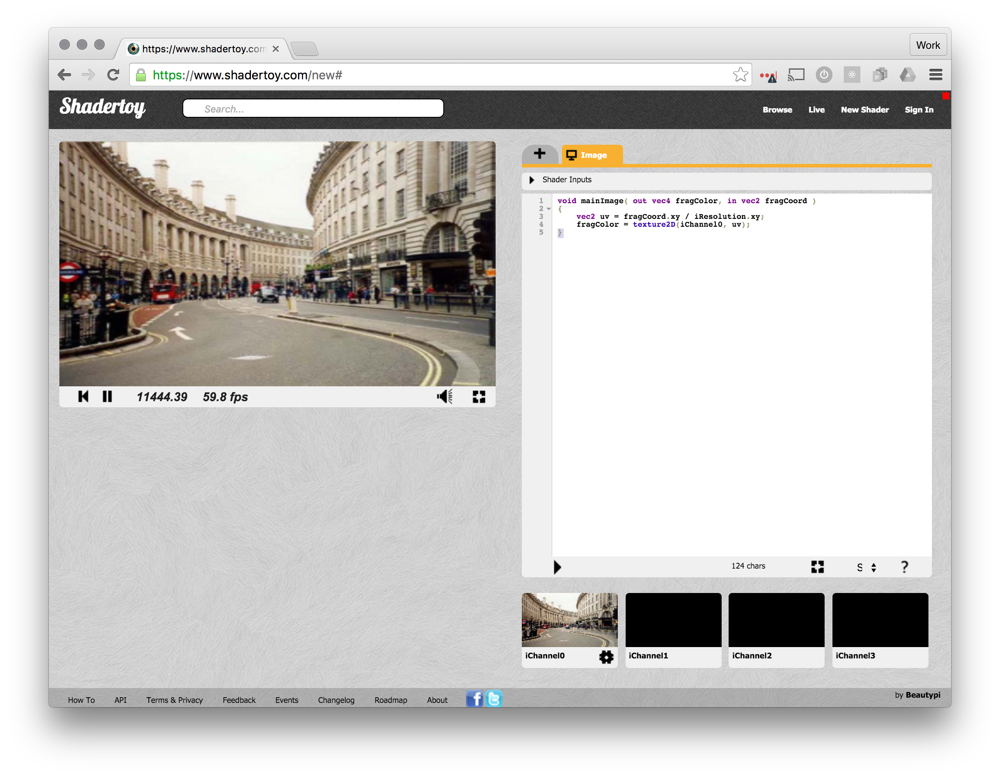

The built-in `texture2D` method will sample our texture in `iChannel0` at the specified *texture coordinate*, `uv`, and returns a `vec4` color. We will talk a bit more about texture coordinates later, but for now let's see if we can change the image colors a bit!

### More Blues

No that we have an image let's manipulate it by only displaying the blue channel from our 3 RGB channels. We will create a temporary `vec4`, and only pass the blue channel to the final `fragColor`.

```glsl
void mainImage( out vec4 fragColor, in vec2 fragCoord )
{
  vec2 uv = fragCoord.xy / iResolution.xy;
  vec4 color = texture2D(iChannel0, uv);
  fragColor = vec4(0.0, 0.0, color.b, 1.0);
}
```

This gives a nice blue tint to our image:

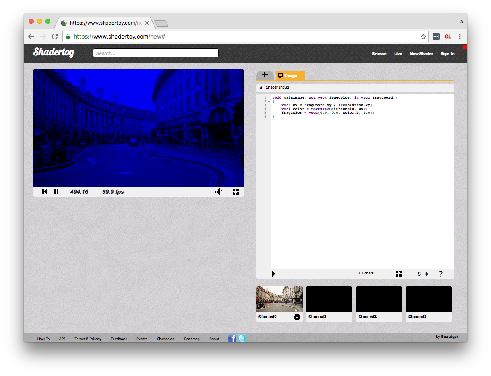

With a similar approach, we can turn the image black & white. Here we use `color.bbb`, which expands to `vec3(color.b, color.b, color.b)`.

```glsl
void mainImage( out vec4 fragColor, in vec2 fragCoord )
{
  vec2 uv = fragCoord.xy / iResolution.xy;
  vec4 color = texture2D(iChannel0, uv);
  fragColor = vec4(color.bbb, 1.0);
}
```

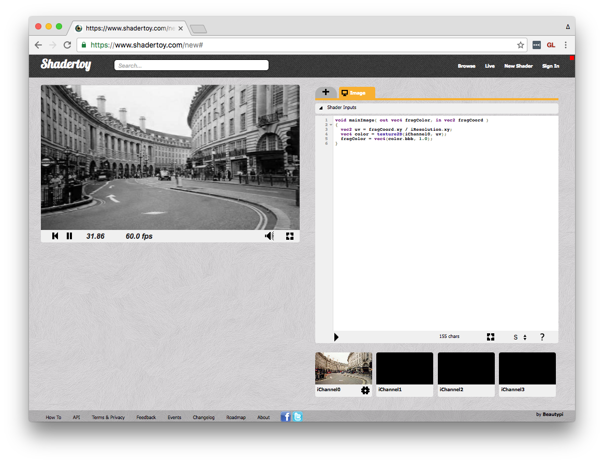

> :bulb: **Note:** This is a naïve approach to grayscale an image — there are some other approaches that compensate for the way the human eye perceives the three color channels.

## UV Space

So what is the `uv` for, you might ask? This `vec2` represents the texture coordinates for that pixel, which tells the shader where in the texture the pixels should be fetched.

In WebGL, texture coordinates typically start at `(0.0, 0.0)` in the *lower* left, and go to `(1.0, 1.0)` in the upper left.

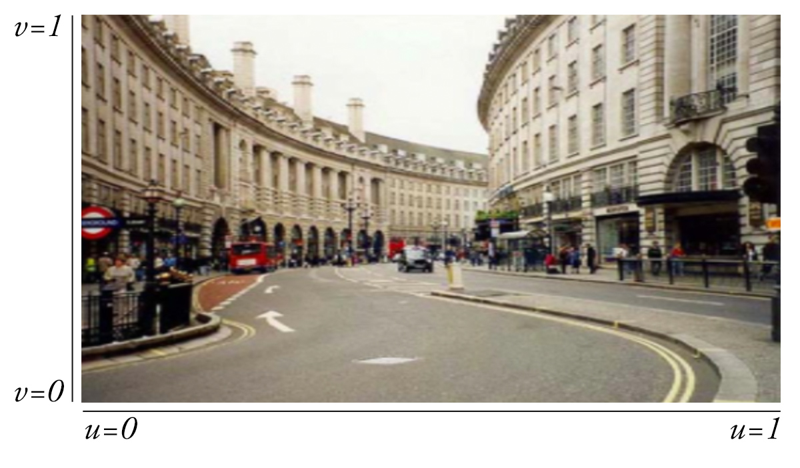

We can confirm this by rendering the `uv.x` and `uv.y` coordinates independently to the screen. For example, `uv.x` will show a gradient from black (i.e. `0.0`) to white (i.e. `1.0`).

```glsl
void mainImage( out vec4 fragColor, in vec2 fragCoord )
{
  vec2 uv = fragCoord.xy / iResolution.xy;
  vec4 color = texture2D(iChannel0, uv);
  fragColor = vec4(vec3(uv.x), 1.0);
}
```

Result:

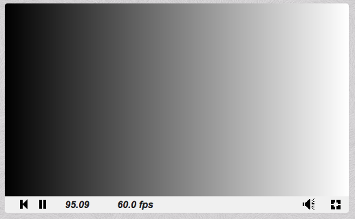


By manipulating this vector, we can change the way the texture is *sampled*, leading to a variety of interesting effects.

# Flip & Scale

By multiplying the `uv.x` and/or `uv.y` by -1, we can flip the image horizontally and/or vertically.

```glsl
void mainImage( out vec4 fragColor, in vec2 fragCoord )
{
  vec2 uv = fragCoord.xy / iResolution.xy;
  uv.y *= -1.0;
  vec4 color = texture2D(iChannel0, uv);
  fragColor = vec4(color.rgb, 1.0);
}
```

Result:

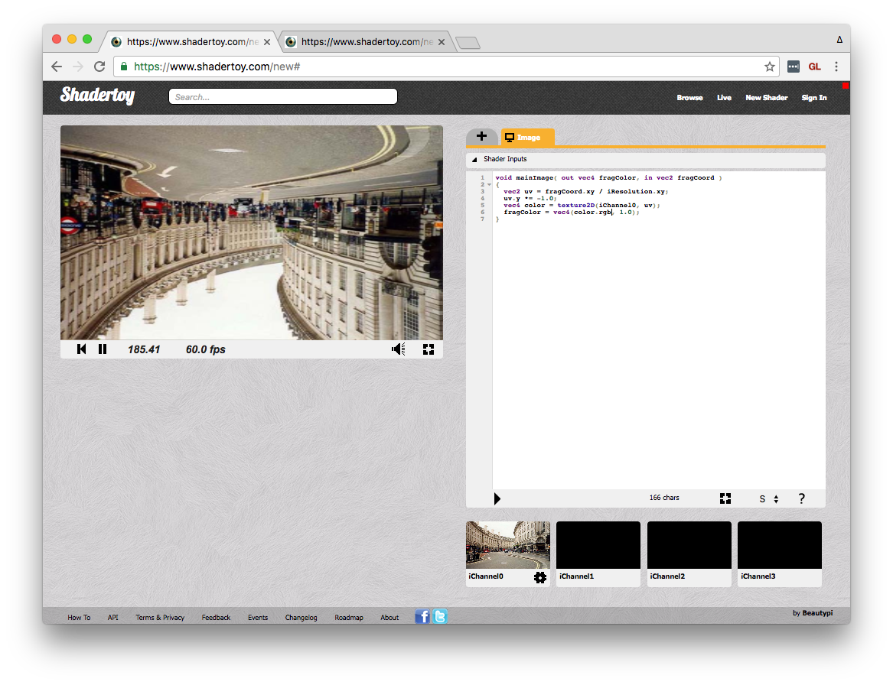

You can multiply the UV coordinates by a number greater than `1.0` to "zoom out" or less than `1.0` to "zoom in." In reality, we are just modifying how the program will sample the texture.

```glsl
vec2 uv = fragCoord.xy / iResolution.xy;
uv *= 0.5;
vec4 color = texture2D(iChannel0, uv);
```

> :bulb: If you multiply a vector by a single number, it multiplies all components of the vector by that number.

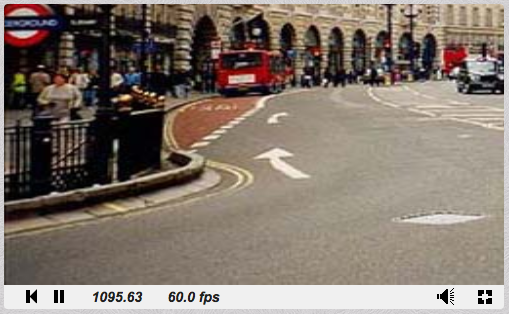

# Pinch Distortion

Lastly, let's try something a bit more advanced. We know that `(0.5, 0.5)` is the center of the screen, and if we take the current coordinate and subtract that point, we will end up with a direction vector that gets larger for pixels further away from the center.

```glsl
vec2 direction = uv - 0.5;
```

> :bulb: The above is equivalent to:
> ```glsl
vec2 direction = vec2(uv.xy - vec2(0.5, 0.5));
```

Now, we can get the *length* or *magnitude* of this vector to determine how far away the current pixel is from the center. We can use this to scale the `uv` coordinates:

```glsl
vec2 direction = uv - 0.5;
uv *= length(direction);
```

Result:

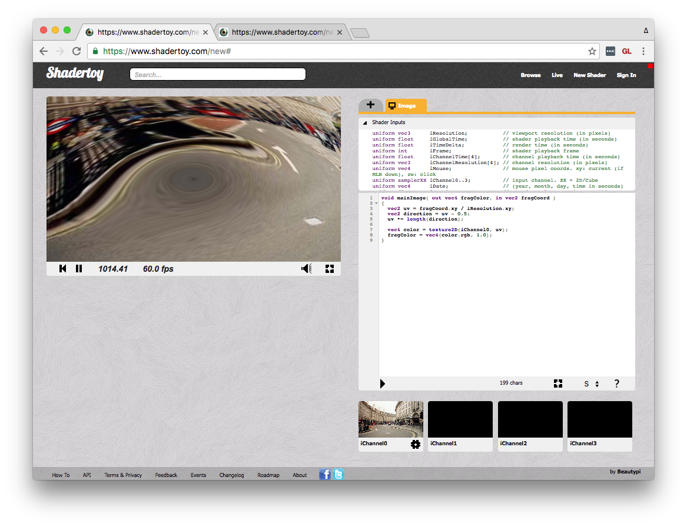

#### Aspect Correction

Finally, let's make the squash effect a circle, rather than an ellipse, by correcting for our rectangular aspect ratio.

To do this, we will modify the `direction` vector before computing its length, so that our distance from center is not affected by the rectangular aspect ratio. We can use `iResolution` to get the width and height of the canvas in pixels.

```glsl
void mainImage( out vec4 fragColor, in vec2 fragCoord )
{
  vec2 uv = fragCoord.xy / iResolution.xy;
  vec2 direction = uv - 0.5;
  direction.x *= iResolution.x / iResolution.y;
  uv *= length(direction);

  vec4 color = texture2D(iChannel0, uv);
  fragColor = vec4(color.rgb, 1.0);
}
```

Result:

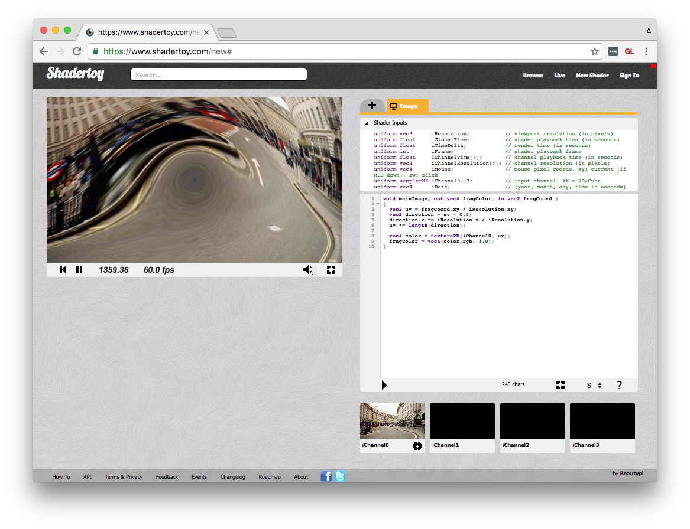

## Next Steps

That's all for this lesson! Future lessons will explore fragment shaders in ThreeJS, vertex shaders, and other more advanced concepts.

Stay tuned! :smile:

## Further Reading

- [The Book of Shaders](https://thebookofshaders.com/) by Patricio Gonzalez Vivo
- [LWJGL Shader Lessons (Java)](https://github.com/mattdesl/lwjgl-basics/wiki/Shaders)

## Authors

- [Jonathan McKinnell](https://twitter.com/jonathanmc)
- [Matt DesLauriers](https://twitter.com/jonathanmc)
